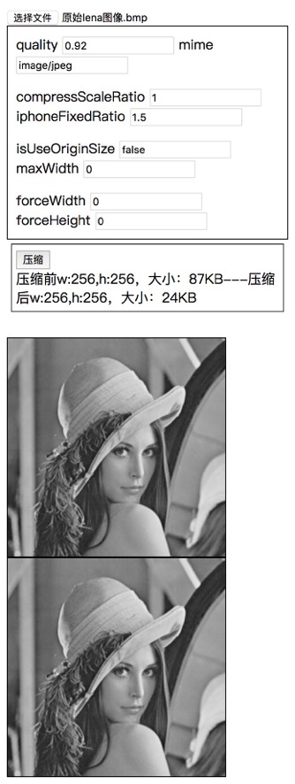

# Image-Scale

图像的缩放

单独打包为`img-scale`模块

## 示例

[https://dailc.github.io/image-process/examples/scale.html](https://dailc.github.io/image-process/examples/scale.html)

[https://dailc.github.io/image-process/examples/scale_compress.html](https://dailc.github.io/image-process/examples/scale_compress.html)

## 效果



## 引入

```js
dist/image-scale.js
```

全局变量

```js
ImageScale
```

调用方法

```js
ImageScale.method()
```

## API

### scaleImageData

对`ImageData`类型的数据进行缩放，将数据放入新的`ImageData`中

```js
ImageScale.scaleImageData(imageData, newImageData, {
    // 0: nearestNeighbor
    // 1: bilinearInterpolation
    // 2: bicubicInterpolation
    // 3: bicubicInterpolation2
    processType: 0,
});
```

__参数说明__

| 参数 | 参数类型 | 说明 |
| :------------- |:-------------:|:-------------|
| imageData | ImageData | 源图像数据 |
| newImageData | ImageData | 新的图像数据-最终结果 |
| args.processType | Number | 处理算法类别，默认为`1`，分别代表三种经典缩放算法 |

### scaleImage

对`Image`类型的对象进行缩放，返回一个`base64`字符串

```js
var base64 = ImageScale.scaleImage(image, {
    width: 80,
    height: 80,
    mime: 'image/png',
    // 0: nearestNeighbor
    // 1: bilinearInterpolation
    // 2: bicubicInterpolation
    // 3: bicubicInterpolation2
    processType: 0,
});
```

__参数说明__

| 参数 | 参数类型 | 说明 |
| :------------- |:-------------:|:-------------|
| image | Image | 源图像 |
| args.processType | Number | 处理算法类别，默认为`1`，分别代表三种经典缩放算法 |
| args.mime | String | `mime`类型，默认为`image/png` |
| args.width | Number | 结果图像的宽 |
| args.height | Number | 结果图像的高 |

__参数说明__

| 参数 | 参数类型 | 说明 |
| :------------- |:-------------:|:-------------|
| base64 | String | 缩放后图像的`base64`字符串 |

### compressImage

compressImage，返回一个`base64`字符串

与scale的区别是这用的是canvas自动缩放，并且有很多参数可控

```js
var base64 = ImageScale.compressImage(image, {
    // 压缩质量
    quality: 0.92,
    mime: 'image/jpeg',
    // 压缩时的放大系数，默认为1，如果增大，代表图像的尺寸会变大(最大不会超过原图)
    compressScaleRatio: 1,
    // ios的iPhone下主动放大一定系数以解决分辨率过小的模糊问题
    iphoneFixedRatio: 2,
    // 是否采用原图像素（不会改变大小）
    isUseOriginSize: false,
    // 增加最大宽度，增加后最大不会超过这个宽度
    maxWidth: 0,
    // 使用强制的宽度，如果使用，其它宽高比系数都会失效，默认整图使用这个宽度
    forceWidth: 0,
    // 同上，但是一般不建议设置，因为很可能会改变宽高比导致拉升，特殊场景下使用
    forceHeight: 0,
});
```

__参数说明__

| 参数 | 参数类型 | 默认值 |说明 |
| :------------- |:-------------:|:-------------:|:-------------|
| quality | Number | 0.92 | 图像压缩质量，注意，为`1`的时候可能比原图还大 |
| mime | String | 'image/jpeg' | 生成图像时的`MIME`类型 |
| compressScaleRatio | Number | 1 | 裁剪压缩时的缩放系数，最终尺寸为：`屏幕像素*像素比（手机一般为2）*compressScaleRatio` |
| iphoneFixedRatio | Number | 2 | 在`iphone`情况下再放大一个系数，以解决可能的模糊问题，最终尺寸为：`已计算的最终尺寸*iphoneFixedRatio` |
| isUseOriginSize | Boolean | false | 是否采用原图像素，__优先级高于上述所有__，如果为`true`，最终尺寸为：`原图大小` |
| maxWidth | Number | 0 | 最大宽度，__优先级高于上述所有__，大于这个宽度的图片会强行缩放成这个宽，小于的按照上面的规则进行缩放，为`0`时表示不设置 |
| forceWidth | Number | 0 | 强制设置宽度，__优先级高于上述所有__，最终宽度为：`forceWidth`，为`0`时表示不设置 |
| forceHeight | Number | 0 | 同上，但是一般不建议设置，因为很可能会改变宽高比导致拉升，特殊场景下使用 |
